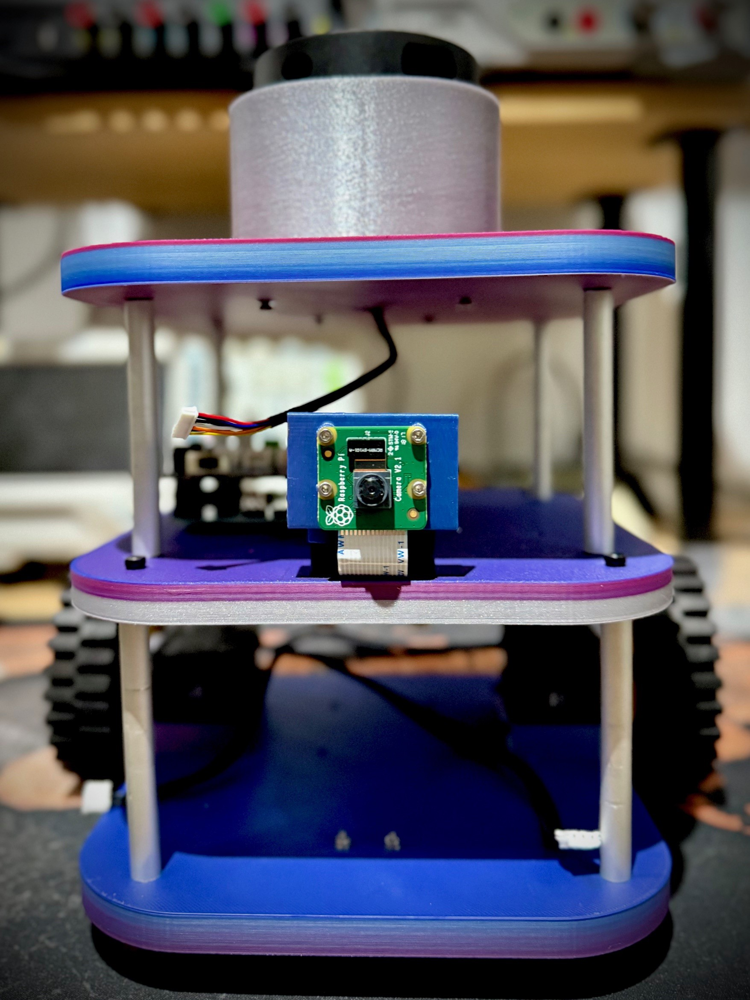

# AKIRO - ROS 2 Robot Project
    
## Objective 
AKIRO is an Open Source Robotics learning platform inspired by Turtlebot3 Burger

## Setup 

### ROS2 Humble
https://creatronix.de/so-installierst-du-ros-2-auf-dem-raspberry-pi-ball-chaser-mit-ros2/

### apt Dependencies
Install all apt dependecies from [apt-requirements.txt](apt-requirements.txt)

## Python Dependencies
Install all python dependencies via 

    pip install -r pip-requirements.txt

## Build
    
    colcon build
    source install/setup.bash

## Start nodes via launchfile

    ros2 run ball_tracker start_robot.launch.py

## Trouble Shooting
### Check camera status

    v4l2-ctl --list-devices

### Lock dependencies

    dpkg-query -W -f='${binary:Package}=${Version}\n' | grep ros- > ros2-packages.lock

### Range detector

    python3 range_detector.py --image tennis-ball.jpg --filter HSV --preview
